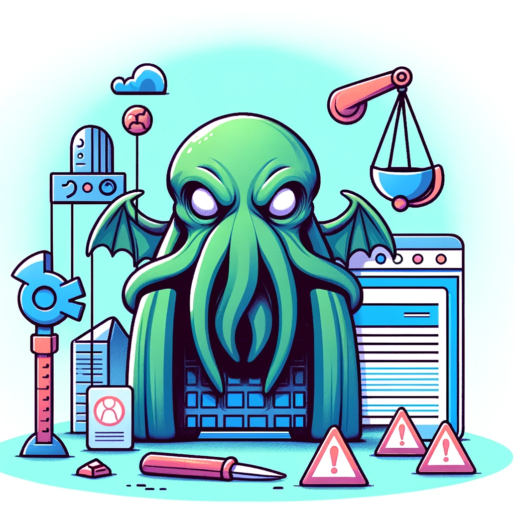

# Poll For Errors



## Overview

"Poll For Errors" is an AWS Lambda function powered by Selenium, designed to capture and return rendered JavaScript log messages displayed in the browser console. This tool is particularly useful for monitoring web applications, detecting JavaScript errors, and integrating into health check systems like those commonly used in Django applications.

## Features

- **AWS Lambda Integration**: Designed to run as a Lambda function, allowing for scalability and ease of deployment.
- **Selenium-Powered**: Leverages the capabilities of Selenium for browser automation to accurately capture console logs from web pages.
- **Docker Support**: Comes with Dockerfile for easy building and deployment, ensuring a consistent environment for the Lambda function.

## Getting Started

### Prerequisites

- AWS CLI configured with the necessary permissions.
- Docker installed on your machine.
- Basic knowledge of AWS Lambda and Docker.

### Building the Dockerfile

1. Clone the repository:
   ```bash
   git clone https://github.com/yourusername/poll-for-errors.git
   cd poll-for-errors
   ```

2. Build the Docker image:
   ```bash
   docker build -t poll-for-errors .
   ```

3. Tag and push the image to your AWS Elastic Container Registry (ECR):
   ```bash
   docker tag poll-for-errors:latest <your-ecr-repository-url>:latest
   docker push <your-ecr-repository-url>:latest
   ```

4. Update your AWS Lambda function to use the new container image from ECR.

### Using in Django Health Checks

To integrate "Poll For Errors" with a Django application for health checking:

1. **Create a Django View**: This view should trigger the Lambda function (e.g., using AWS SDK for Python - Boto3).

2. **Parse Lambda Response**: Analyze the response from the Lambda function in your Django view. If JavaScript errors are found, you can take appropriate actions like sending alerts or logging details.

3. **Schedule Regular Checks**: Utilize Django's scheduling capabilities or a task scheduler like Celery to periodically invoke this health check.

## Recommendations

- **Memory Allocation**: Ensure your Lambda function has sufficient memory allocated, as running a headless browser can be resource-intensive.
- **Error Handling**: Implement robust error handling in both the Lambda function and the Django view to gracefully manage exceptions.
- **Security**: Secure the communication between your Django application and AWS Lambda. Ensure that your AWS credentials are not exposed.

## Contributing

Contributions are what make the open-source community such an amazing place to learn, inspire, and create. Any contributions you make are **greatly appreciated**.

## License

Distributed under the MIT License. See `LICENSE` for more information.
